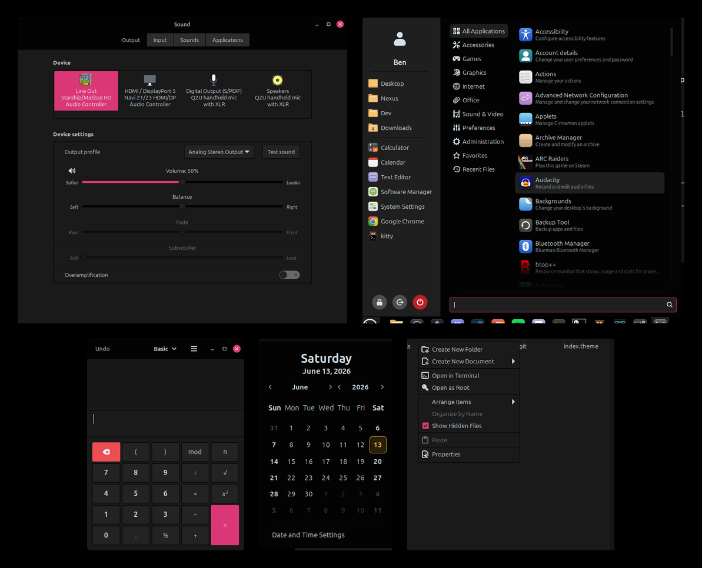
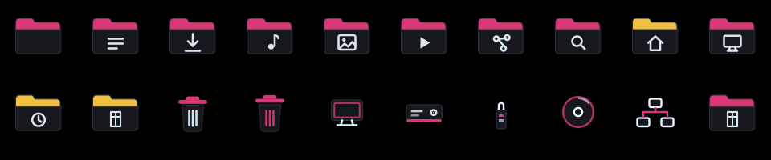
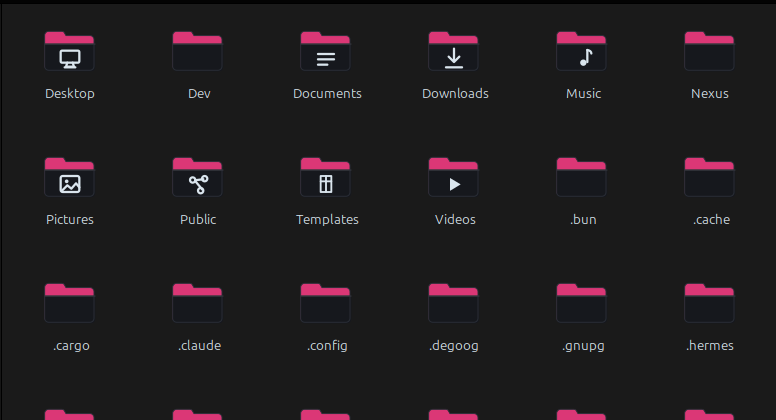
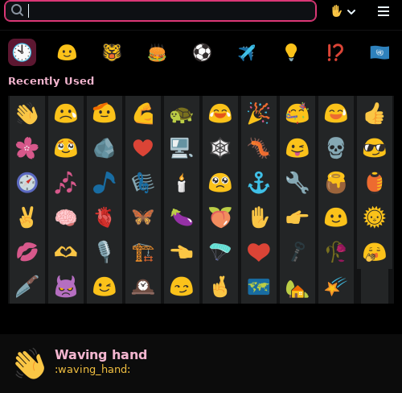
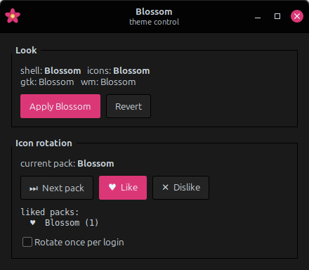
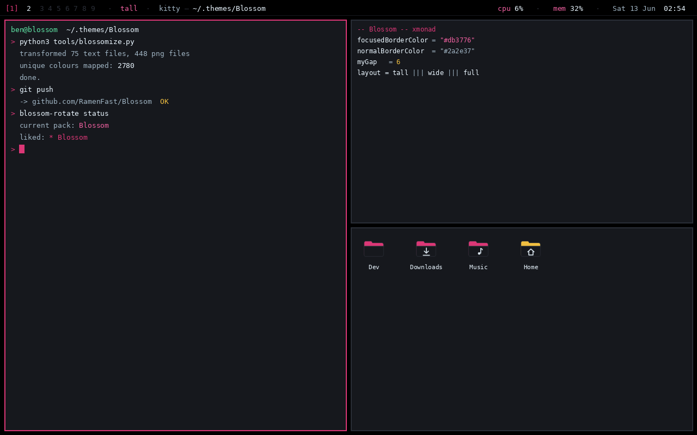
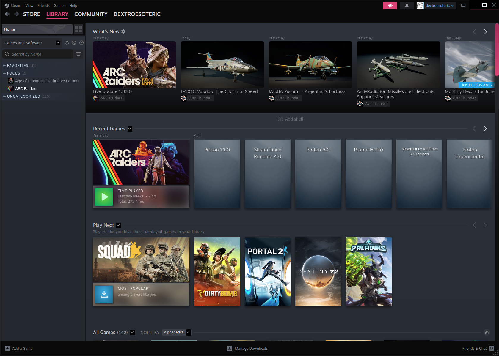

# Blossom

A cohesive Cinnamon desktop theme: **AMOLED true-black**, soft **pink** (primary)
and **gold** (secondary), with a light blue for text — built so the *look itself*
carries information importance.



## Palette

| | Colour | Role |
| --- | --- | --- |
| ⚫ | `#000000` | base — true black (AMOLED); raised surfaces lift to `#0a0a0a`–`#3b3b3b` |
| 🌸 | pink `#db3776` | **primary** accent — selection, focus, links, sliders, the suggested/primary action, the active window, menu selection |
| 🟡 | gold `#f1bf40` | **secondary / supporting** — marks *today* in the calendar (the reference point) and all *warnings* |
| 🩵 | `#eaf6ff` | text & icons — the Phosphor vectorscope's light blue (dims toward `#9fb3c2` for secondary text) |
| 🔴 | red `#ec4e53` | critical only — close button, log-out/shutdown, "remove", destructive actions, demands-attention |
| 🟢 | green `#52a462` | kept (softened) purely for the *success* semantic |

The design rule: **pink is what you're acting on, gold is the reference you're
acting against, red is danger.** Importance reads through colour — the bright
accent lands on the one element that matters right now, everything else stays
black-and-light-blue and recedes.

## What's themed

A full Cinnamon "look", all driven from one palette:

- **Cinnamon shell** (`cinnamon/`) — panel, menu, calendar, applets, popups, OSD
- **GTK 3** (`gtk-3.0/`) — application widgets + recoloured check/radio/switch assets
- **GTK 4 / libadwaita** (`gtk-4.0/`, `libadwaita-1.5/`, `libadwaita-1.7/`) — incl. a forced pink accent
- **Metacity** (`metacity-1/`) — window borders / title bars (true-black, light-blue title, red close)
- **GTK 2** (`gtk-2.0/`) — legacy apps
- **xfwm4 / openbox-3** — carried through for completeness
- **Icons** (`icons/Blossom/`) — a matching icon pack (see below)
- **Steam** (`steam/`) — the client *and* its embedded web store, injected at runtime
- **Applications** (`apps/`) — kitty & ghostty, btop, xed/GtkSourceView, Qt apps
  (qt5ct palette), flatpak GTK apps, Obsidian — plus ready-to-enable Discord and
  Spotify themes. One installer: `apps/install.sh`.
- **Emoji** (`blob-emojis/`) — Blobmoji, the blob emoji continuation, as the
  desktop-wide emoji font (see below). One installer: `blob-emojis/install.sh`.

## Icons



A small, high-impact icon pack in the same language: **void-dark folders under a
pink header**, differentiated by a **light-blue line glyph**, with **gold** marking
your *anchor* folders (home, recent, bookmarks). Trash, drives, computer and
network are drawn the same way — dark body, light-blue lines, a pink accent.



Everything else — application icons, mimetypes, the long tail — is **inherited from
Papirus-Dark**, so the set stays small and consistent while showing up exactly
where it counts: the Nemo sidebar, the desktop, file dialogs. It's a scalable SVG
theme generated by `tools/blossom_icons.py` (folder template + a glyph dict), so
adding a folder variant is a one-line change.

```bash
ln -sfn ~/.themes/Blossom/icons/Blossom ~/.icons/Blossom   # install
gsettings set org.cinnamon.desktop.interface icon-theme 'Blossom'
```

Want a different app-icon base? Change the `Inherits=` line in
`icons/Blossom/index.theme` (e.g. to `Mint-Y`) and re-run the generator.

## Emoji — blobs



Google's blob emoji — the Android Lollipop-era gumdrops, continued by the
community as [Blobmoji](https://github.com/C1710/blobmoji) — as the emoji font
for the whole desktop: terminals (kitty, ghostty, VTE), GTK & Qt apps,
Chromium/Electron, and **every flatpak**, including the Emote picker. Text
fonts are untouched — fontconfig only reroutes emoji fallback — and Noto Color
Emoji stays installed as the safety net for post-Unicode-15 additions.

```bash
cd blob-emojis && ./install.sh   # user level + every installed flatpak · --uninstall reverts
```

Re-run the installer after installing a new flatpak so it gets the config too.
Details, verification probes and caveats: `blob-emojis/README.md`.

## How it's built

Rather than hand-edit ~1.5 MB of upstream CSS, the theme is **generated** by a
small HSL colour engine, `tools/blossomize.py`, which forks Linux Mint's
`Mint-Y-Dark-Aqua` (+ `Mint-L-Dark-Aqua` window borders) and routes every colour:

- near-neutral **darks** → a black-anchored ramp (true-black base, gentle elevation)
- near-neutral **lights** → tints of `#eaf6ff` (text / icons)
- saturated **blue** (Mint's accent family) → **pink**
- saturated **orange** → **gold**;  **red** kept (cleaned);  **green** kept (softened, success only)

It also reconciles a few semantics the hue-router can't infer: the *suggested
action* (green upstream) is pulled onto the pink accent ramp, libadwaita's accent
is forced pink, and a small "Blossom polish" block paints menu/calendar selection.

```bash
python3 tools/blossomize.py     # regenerates every theme subdir in place
```

The generated files are committed, so the theme is usable without running the
engine — re-run it only to **re-tune the palette**. The knobs live at the top of
`blossomize.py` (`PINK_HUE`, `PINK_SAT_MUL`, `PINK_L_LIFT`, `GOLD_HUE`, the dark
ramp `DARK_KNEE`/`DARK_SLOPE`, …). Want a softer, more pastel pink? Nudge
`PINK_L_LIFT` up and `PINK_SAT_MUL` down, then re-run.

## Install & apply

Clone into your user themes dir so Cinnamon loads it directly:

```bash
git clone https://github.com/RamenFast/Blossom.git ~/.themes/Blossom
```

Then apply with:

```bash
gsettings set org.cinnamon.theme name 'Blossom'                       # shell
gsettings set org.cinnamon.desktop.interface gtk-theme 'Blossom'     # apps
gsettings set org.cinnamon.desktop.wm.preferences theme 'Blossom'    # window borders
gsettings set org.cinnamon.desktop.interface icon-theme 'Blossom'    # icons
```

…or pick **Blossom** in *System Settings → Themes*. Pairs well with the
**Mint-Y-Sand** icon set (gold-leaning folders echo the secondary accent).
Iterate live: edit → re-run the engine → re-select the theme (or `Ctrl+Alt+Esc`
to reload Cinnamon).

## Control GUI & the panel

Two panel touches tie the look together:

- The **menu button** is a recoloured Linux Mint logo — a pink → gold → light-blue
  gradient ring around a **mint-green LM** monogram
  (`icons/Blossom/apps/scalable/blossom-logo.svg`).
- A **Blossom Control** button — the pink flower — opens a small GTK app: apply
  the look, and rotate / like icon packs, in one window. Being a GTK app it's
  themed by Blossom itself, so the control surface looks like what it controls.
  It's the pattern for any future one-off Blossom UI.




```bash
# recoloured menu logo (per-applet setting wins over the global one):
python3 - <<'PY'
import json, glob
for f in glob.glob(__import__("os").path.expanduser(
        "~/.config/cinnamon/spices/menu@cinnamon.org/*.json")):
    d = json.load(open(f)); d["menu-icon"]["value"] = "blossom-logo"
    json.dump(d, open(f, "w"), indent=4)
PY
# launcher for the control app (flower icon):
cat > ~/.local/share/applications/blossom-control.desktop <<EOF
[Desktop Entry]
Type=Application
Name=Blossom Control
Exec=python3 $HOME/.themes/Blossom/tools/blossom-control.py
Icon=blossom-flower
Terminal=false
Categories=Settings;Utility;
EOF
```

Then right-click the panel → *Add applets* → **Panel launchers**, or drag the
menu entry onto the panel, to pin the flower. Remove any time with right-click →
*Remove*. (Both need a Cinnamon reload — `Ctrl+Alt+Esc` — to repaint.)

## Daily rotation — find your taste

`tools/blossom-rotate.py` cycles the *icon* theme through a curated list of packs,
one per day, and lets you mark the days you like — so over time a picture of your
taste emerges (which packs you keep coming back to). Your Blossom GTK + Cinnamon
look stays put; only the app/folder icons rotate.

```bash
python3 tools/blossom-rotate.py status     # current pack + your taste tally
python3 tools/blossom-rotate.py like        # "today's pack is a keeper"
python3 tools/blossom-rotate.py next        # try the next one now
python3 tools/blossom-rotate.py install     # rotate once per login (autostart)
```

It auto-discovers the icon themes you already have installed; edit
`~/.local/share/blossom-rotate/state.json` to curate the rotation. `install` is
opt-in — nothing changes your icons on a schedule until you ask for it.

## xmonad — Blossom as a tiling session

The thesis, made *structural*: in a tiling WM the accent isn't paint on a widget —
it's the **focused window's border**, and the gaps are the void showing through.
`wm/` is a complete Blossom xmonad session you can hop into alongside Cinnamon (it
touches nothing in your current setup — it's just a second door at the login screen).



*A mockup (rendered from the real palette + the actual folder icons). The live
session looks the same: pink border = focused, gold = a window that wants you,
true-black gaps, xmobar up top.*

**Install** — needs sudo for `apt` + the session file:

```bash
bash wm/install.sh        # installs xmonad/xmobar/dmenu/…, links the config, registers the session
```

Then log out → pick **Blossom (xmonad)** from the session menu → log in. Cinnamon
stays exactly as it was.

**Keys** — mostly xmonad's defaults, which are already vim-shaped (Super = mod):

| key | action | | key | action |
|---|---|---|---|---|
| `Super+Return` | terminal | | `Super+j` / `k` | focus down / up |
| `Super+d` | app launcher | | `Super+h` / `l` | shrink / grow master |
| `Super+w` / `e` | browser / files | | `Super+Shift+j` / `k` | move in stack |
| `Super+c` | Blossom Control | | `Super+Shift+Return` | promote to master |
| `Super+Space` | next layout | | `Super+1..9` | switch workspace |
| `Super+f` | fullscreen | | `Super+Shift+1..9` | send to workspace |
| `Super+b` | toggle bar | | `Super+Shift+c` | close window |

New windows join the **stack** to the right of the master — predictable, every
time. Config: `wm/xmonad/xmonad.hs` · bar: `wm/xmobar/xmobarrc` · compositor:
`wm/picom.conf`. The palette lives at the top of `xmonad.hs`.

## Steam — the look, inside the client

`steam/` carries Blossom into the **Steam client**: AMOLED true-black, pink
accent (the blue Steam paints everywhere becomes pink), gold/red/green semantics
kept — and **game art is never recoloured**.



Modern Steam is a Chromium app that restores its own CSS on every launch, so the
skin is **injected at runtime over Steam's built-in CEF debugger** — *no sudo, no
Millennium*. A small **Rust** binary (`steam/blossom-steam/`) paints every window
in <0.2 s and re-applies at login; the colour remap is **generated** from Steam's
live stylesheets (`blossom-steam gen`) and committed, exactly like the rest of
Blossom. A Millennium path is provided too.

```bash
cd steam && ./install.sh        # builds the binary, themes Steam now + at every login
```

See `steam/README.md` for the palette mapping, the generator, and the Millennium
option.

## Environment

Built and tested on Linux Mint · Cinnamon 6.6.7 · X11 · 40 px panel.
The xmonad session targets xmonad 0.17 (Mint/Ubuntu `apt`).
