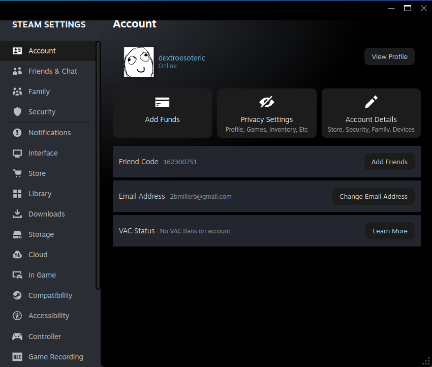

# Blossom for Steam ❀

The Blossom desktop look, carried into the **Steam client**: AMOLED true-black,
**pink** primary, **gold** secondary, light-blue text — and **game art is never
recoloured**. The accent blue Steam paints everywhere becomes pink; its slate
greys collapse onto the black-anchored ramp; toggles, primary buttons and focus
glow pink (what you're acting on), while static labels recede to light-blue.




## Palette mapping

| Steam | → Blossom | where |
| --- | --- | --- |
| `#1a9fff` accent blue | 🌸 pink `#db3776` | active tab, toggles-on, links, sliders, focus |
| `#67c1f5` light accent | pink-hi `#e85a92` | hovers, secondary accents |
| `#3d4450` slate surface | `#1c1c1c` | cards, rows, controls |
| `#0e141b` / `#171d25` dark | `#000` / `#0a0a0a` | windows, headers, the void |
| Steam green (Play / online) | kept | the "ready / success" semantic |
| text greys | light-blue `#eaf6ff` / `#9fb3c2` | all copy |

## How it works (and why it's not just CSS files)

Modern Steam is a Chromium (CEF) app, and it **restores its `steamui` CSS from
the client package on every launch** — so a skin can't live in those files. The
two ways to inject at runtime are *Millennium* (a sudo'd bootstrap) or Steam's
**own CEF remote debugger** (a localhost port Valve ships, opt-in via a marker
file). This skin uses the debugger — **no sudo, no Millennium**.

`blossom-steam/` is a small **Rust** binary that drives it:

```
blossom-steam live     enable debugging if needed, then keep every window themed
blossom-steam once     inject into the open windows once and exit
blossom-steam gen      regenerate generated.css from Steam's live stylesheets
blossom-steam enable    turn on CEF debugging + restart Steam
```

It connects to each CEF page over the debugger and injects two stylesheets:

- **`webkit.css`** — the hand-written foundation: backgrounds, text, buttons,
  dialogs, inputs, scrollbars, title bar, focus, tooltips, and the Blossom
  polish. Targets Steam's *stable* design-system classes (`.DialogButton`,
  `.ModalDialogPopup`, `.PageListColumn`, `.gpfocus`, …), so it survives updates.
- **`generated.css`** — the colour remap. Steam hardcodes its accent blue and
  greys in ~700 rules whose class names are hashed and churn on every update, so
  rather than chase them by hand, `blossom-steam gen` walks the *live* stylesheets
  and re-emits each of those rules in the Blossom palette. Committed, like the
  rest of Blossom — re-run only after a Steam **client** update changes the hashes.

Injection is fast: ~15 windows themed in **<0.2 s** from a 600 KB native binary.

## Install (no sudo)

```bash
./install.sh            # builds the Rust binary, enables the debugger, paints
                        # every window now, and adds a login autostart
./install.sh --uninstall
```

Needs Rust (`cargo`; https://rustup.rs). The installer adds
`~/.config/autostart/blossom-steam.desktop` so the skin re-applies at every login.

**Trade-off:** this keeps a **localhost-only** CEF debug port (8080) open while
Steam runs, and a light background process. If you'd rather not, use Millennium.

## Install (Millennium, optional — cleaner, but needs sudo once)

[Millennium](https://steambrew.app) injects without a debug port or daemon. Install
it once (this patches Steam; needs your password):

```bash
curl -fsSL https://raw.githubusercontent.com/SteamClientHomebrew/Millennium/main/scripts/install.sh | sh
```

Then link Blossom in and enable it:

```bash
./install.sh --millennium       # links this dir into steamui/skins/Blossom
# Steam → Millennium → Themes → Blossom
```

`theme.json` is the Millennium manifest; it injects the same `webkit.css` +
`generated.css` into every tab.

## After a Steam client update

The hashed class names in `generated.css` may go stale (some accents revert to
blue). `webkit.css` keeps the foundation intact regardless. To refresh the remap:

```bash
blossom-steam gen        # re-derives generated.css from the running client
```

## Files

```
webkit.css            hand-written foundation + Blossom polish (stable selectors)
generated.css         committed colour remap (regenerate with `blossom-steam gen`)
theme.json            Millennium manifest
install.sh            native (no-sudo) installer · --millennium · --uninstall
blossom-steam/        the Rust tool (live / once / gen / enable)
```
